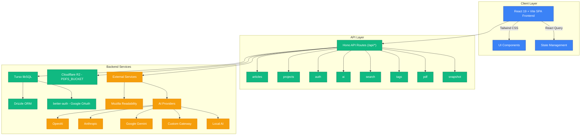

# Web Annotator

**Product:** [read.significanthobbies.com](https://read.significanthobbies.com)


A modern web application for capturing and annotating articles with a distraction-free reading experience.

## Deployment & External Services

| Concern      | Service                                                                                      |
| ------------ | -------------------------------------------------------------------------------------------- |
| Hosting      | Cloudflare Workers (`reader`) via Hono Worker (`src/worker.ts`)                              |
| Database     | Turso (libSQL) via Drizzle ORM                                                               |
| Auth         | better-auth + Google OAuth                                                                   |
| File storage | Cloudflare R2 (`reader-pdfs`, bound as `PDFS_BUCKET`)                                        |
| AI           | free-ai-gateway (Workers AI chokepoint); BYOK providers (OpenAI/Anthropic/Gemini) + local AI |
| CI/CD        | GitHub Actions — auto-deploy to Cloudflare on push to `main`                                 |

## Problem

Information overload is real. You find valuable articles across the web, but there's no easy way to save them in a clean format, annotate them with your thoughts, and organize them for future reference. Browser bookmarks are cluttered, read-it-later apps lack annotation capabilities, and note-taking tools don't handle web content well.

Web Annotator solves this by providing a personal research library where you can capture, read, annotate, and organize web content in one place.

## Features

### Content Management

- **Clean Article Extraction**: Save articles from any URL using Mozilla Readability
- **PDF Support**: Upload, view, and annotate PDF documents with text extraction
- **Rich Annotations**: Add contextual notes with optional DOM anchoring
- **Selection Actions**: After selecting text (mouse up) or selection + right-click, quickly choose `Add note` or `Ask AI`
- **Reading Time Estimates**: Auto-calculated reading time displayed for every article

### Organization & Discovery

- **Tags System**: Multi-tag articles with color-coded badges, autocomplete, and filtering
- **Full-Text Search**: Search across article content, notes, and AI chat history with Cmd/Ctrl+K shortcut
- **Project Organization**: Group related articles into projects
- **Reading Progress**: Track which articles you're reading or have completed

### AI-Powered Features

- **AI Chat**: Ask questions about your articles and notes using BYOK providers (OpenAI, Anthropic, Gemini, Gateway) or local AI mode
- **Auto-Summaries**: Generate intelligent summaries with one click (short/medium/long options)
- **Key Points Extraction**: Automatically extract 3-5 key takeaways from any article
- **Chat History**: Persistent per-article conversations rendered as markdown

### Customization

- **Customizable Reader**: Adjust theme (light/dark/sepia), font family (sans/serif/mono), and text size
- **Secure & Private**: Google Sign-In authentication with per-user data isolation

## Architecture



### Tech Stack

- **Frontend**: Vite + React 19 SPA (single `app.html` entry, client-side routing via `react-router-dom`), TypeScript, Tailwind CSS v4
- **Database**: Turso (libSQL) via Drizzle ORM
- **Auth**: better-auth (Google OAuth, Drizzle adapter)
- **Storage**: Cloudflare R2 (PDFs) via Workers binding
- **AI Integration**: Vercel AI SDK + AI Gateway (preferred), BYOK chat providers, local AI support
- **PDF Processing**: react-pdf, pdfjs-dist, pdf-parse for viewing and text extraction
- **Deployment**: Cloudflare Workers via `wrangler deploy` (Hono worker `src/worker.ts`; built SPA served via `ASSETS` binding)

## Getting Started

### Prerequisites

- Node.js 22+
- A Turso database (`turso db create`) and auth token
- A Cloudflare account with an R2 bucket bound as `PDFS_BUCKET`
- A Google OAuth client (Cloud Console > APIs & Services > Credentials)

### Installation

1. Clone the repository and install dependencies:

   ```bash
   git clone <repository-url>
   cd web-annotator
   pnpm install
   ```

2. Configure environment variables:

   ```bash
   cp .env.example .env.local
   ```

   Edit `.env.local`:

   ```env
   # Turso
   TURSO_DATABASE_URL=libsql://your-db.turso.io
   TURSO_AUTH_TOKEN=...

   # better-auth
   BETTER_AUTH_SECRET=$(openssl rand -base64 32)
   BETTER_AUTH_URL=http://localhost:8787
   GOOGLE_CLIENT_ID=...
   GOOGLE_CLIENT_SECRET=...

   # Cloudflare R2 (used by `pnpm deploy`; local dev uses the wrangler binding)
   CLOUDFLARE_ACCOUNT_ID=...
   R2_ACCESS_KEY_ID=...
   R2_SECRET_ACCESS_KEY=...
   R2_BUCKET_NAME=reader-pdfs

   # Optional
   LOCAL_AI_URL=http://127.0.0.1:3456
   ```

3. Push the schema to Turso:

   ```bash
   pnpm db:push
   ```

4. Run the development server:

   ```bash
   pnpm dev
   ```

   `pnpm dev` starts the Hono Worker (port 8787), the Vite SPA dev server (port 5173, proxies `/api` → 8787), and the local AI server concurrently.
   Local AI providers are shown only in development mode.
   If you only want the SPA:

   ```bash
   pnpm dev:spa
   ```

5. Open [http://localhost:8787](http://localhost:8787) (Worker-served app) or [http://localhost:5173](http://localhost:5173) (Vite SPA only)

### Development Commands

```bash
pnpm dev          # Start Worker + Vite SPA + local AI server (concurrently)
pnpm dev:worker   # wrangler dev only (Worker, port 8787)
pnpm dev:spa      # Vite SPA only (port 5173, proxies /api → 8787)
pnpm local-ai     # Start only the local AI server
pnpm build        # Validate env + Vite build → dist/
pnpm cf:build     # Build SPA + Astro landing + overlay into dist/
pnpm deploy       # validate env + cf:build + wrangler deploy
pnpm lint         # Run ESLint
pnpm format       # Format code with Biome
pnpm typecheck    # tsc --noEmit (app + worker tsconfigs)
pnpm db:push      # Apply schema to Turso (Drizzle)
pnpm db:studio    # Open Drizzle Studio
```

## Deployment

### Cloudflare Workers (Hono Worker)

```bash
pnpm deploy
```

This runs `cf:build` (Vite SPA build + Astro landing overlay into `dist/`) and `wrangler deploy`.
Configure secrets via `wrangler secret put` for `BETTER_AUTH_SECRET`,
`TURSO_AUTH_TOKEN`, `GOOGLE_CLIENT_SECRET`, etc., and bind the R2 bucket as
`PDFS_BUCKET` in `wrangler.toml`.

## Project Structure

```
web-annotator/
├── app.html              # Single SPA HTML entry (Vite input)
├── vite.config.ts        # Vite SPA build (React, Tailwind v4, Lightning CSS)
├── wrangler.toml         # Worker config: main=src/worker.ts, ASSETS + PDFS_BUCKET
├── src/
│   ├── worker.ts         # Hono Worker entry — /api/* routing, asset serving
│   ├── worker/
│   │   └── routes/       # Hono API route modules (articles, ai, pdf, auth, etc.)
│   ├── pages/            # Route page components (LibraryPage, ReaderPage, etc.)
│   ├── components/       # React components (ReaderView, PDFReaderClient, etc.)
│   ├── hooks/            # Shared React hooks
│   ├── lib/
│   │   ├── auth.ts       # better-auth server config
│   │   ├── auth-client.ts# better-auth browser client
│   │   ├── db/           # Drizzle schema + Turso client
│   │   └── storage.ts    # R2 helpers
│   └── types.ts          # TypeScript definitions
├── packages/
│   └── chrome-extension/ # Chrome MV3 extension (separate Vite build)
├── landing-astro/        # Astro landing page (built into deploy via cf:build)
└── agents.md             # Development guide
```

## Development

This project uses automated pre-commit hooks for code quality:

- Prettier (formatting)
- ESLint (linting)
- TypeScript (type checking)

Commit convention follows [Conventional Commits](https://www.conventionalcommits.org/):

```
feat(reader): add PDF export
fix(auth): resolve token refresh issue
chore: update dependencies
```

For comprehensive development documentation, see [AGENTS.md](./AGENTS.md).

## Security

- All HTML content is sanitized before storage
- User authentication required for all operations
- Per-user data isolation enforced at the database level
- Ownership verification on all operations
- BYOK model for AI providers (API keys stored in browser only)

## License

This project is private and not licensed for public use.

<!-- ACTIVE-AI-TASK-LOG:START -->

## Active AI Task Log

This section is maintained by the SaaS Maker Active-AI product/design loop so future agents do not reopen duplicate UI tasks.

- Business lane: P0 Can make money
- Rule: do not create another broad "improve the UI" task unless the acceptance criteria differ materially from the tasks listed here.
- Source of truth for task status: SaaS Maker task board. README entries are durable context only.

| Task                                                                    | Status | Priority | Last known note     |
| ----------------------------------------------------------------------- | ------ | -------- | ------------------- |
| `cad24fee` reader: add empty-source import checklist                    | done   | medium   | 2026-05-26          |
| `c346ed01` reader: add annotation export preview before signup          | done   | high     | 2026-05-26          |
| `87ef7ce1` reader: add sample reading loop proof above the fold         | done   | high     | 2026-05-26          |
| `907a1c6e` reader: review and ship local first-run UI change            | done   | high     | 2026-05-25 18:52:12 |
| `07045aff` reader: library empty state should explain value + focus CTA | done   | high     | 2026-05-25 17:07:15 |
| `0babffde` reader: make mobile import CTA impossible to miss            | done   | medium   | 2026-05-27          |

<!-- ACTIVE-AI-TASK-LOG:END -->
