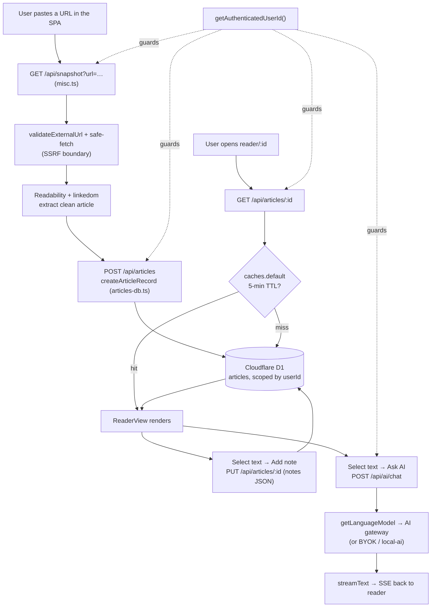

# How Reader Works, End to End

Reader is a personal research library: you capture web articles and PDFs, read
them distraction-free, annotate them with notes and highlights, organise them
with tags/lists/boards, search across everything, and AI-chat or auto-summarise
what you saved. See [product/overview.md](../product/overview.md) for the full
scope; this page explains *how the pieces fit together* and *why the shape is
what it is*.

It is a learning-tier walkthrough: read it once to build a mental model, then
lean on [overview.md](overview.md) and [data-flow.md](data-flow.md) for the
precise request lifecycle, and [decisions/](decisions/) for the reasoning behind
each choice.

## The one-sentence model

A **Vite + React 19 single-page app** (no SSR) runs entirely in the browser and
talks to a **single Hono Worker** on Cloudflare, which routes `/api/*` to
resource handlers, serves the built SPA over the `ASSETS` binding, and fans out
to three backends: **Cloudflare D1** (all structured data), **Cloudflare R2**
(PDF binaries), and an **AI gateway** (Workers AI, with BYOK and a local-dev
bridge as alternatives).

## The components

Every claim below is grounded in the file named next to it.

- **The SPA** (`app.html`, `src/router.tsx`) — one HTML entry, client-side
  routing via `react-router-dom`. Routes lazy-load their page component
  (`library`, `reader/:id`, `board`, `rss`, `memory`, `share/*`, …), so the
  first paint ships only the shell. There is no server rendering.
- **The Worker entry** (`src/worker.ts`) — the single `fetch` handler. It is
  the front door for *everything*: agent-indexing surfaces, the `/api/*` Hono
  router, and the static SPA/landing assets.
- **Resource routers** (`src/worker/routes/*.ts`) — one Hono router per
  resource (`articles`, `boards`, `lists`, `memories`, `ai`, `keys`, `pdf`,
  `rss`, `share`, plus `misc` for search/snapshot/proxy/export). Each is
  mounted under `/api/<resource>` in `src/worker.ts`.
- **Auth resolution** (`src/lib/auth.ts`, `src/lib/auth-api.ts`) — better-auth
  with Google OAuth for the webapp, plus an `rdr_*` API-key path for the Chrome
  extension. `getAuthenticatedUserId()` is the single choke point every
  protected handler calls first.
- **Data layer** (`src/lib/db/`, `src/lib/*-db.ts`) — Drizzle over the Worker's
  D1 binding, wrapped in `*-db.ts` helpers (`articles-db.ts`, `lists-db.ts`,
  …) that own queries, ownership scoping, and edge-cache invalidation.
- **PDF storage** (`src/lib/storage.ts`, `src/worker/routes/pdf.ts`) — binaries
  live in the R2 `PDFS_BUCKET`; the DB stores only a `blob://<key>` reference,
  and downloads are proxied so clients never see a raw R2 URL.
- **AI routing** (`src/lib/ai-cloudflare.ts`, `src/worker/routes/ai.ts`) — an
  OpenAI-compatible provider pointed at the free-ai gateway by default, with
  BYOK and local-dev alternatives, driven by the Vercel AI SDK.
- **Safe fetch boundary** (`src/lib/url-validation.ts`, `src/lib/safe-fetch.ts`)
  — every server-side outbound fetch (snapshot, proxy, RSS refresh) passes
  through SSRF validation and redirect re-validation.
- **The Chrome extension** (`packages/chrome-extension/`) — a separate MV3
  build that captures pages in the browser and authenticates with an API key
  rather than the same-origin cookie.

## The primary flow: capture → read → annotate → chat

This is the path most user data takes. It stitches the components above into one
story.

1. **Capture.** You paste a URL. The SPA calls `GET /api/snapshot?url=…`
   (`src/worker/routes/misc.ts`). The Worker — not the browser — fetches the
   page through the safe-fetch boundary, then runs Mozilla `Readability` over a
   `linkedom`-parsed DOM to strip nav/ads/chrome down to clean article HTML and
   metadata (title, byline, siteName). Doing extraction server-side means it
   works regardless of the origin's CORS policy and keeps the heavy parser out
   of the client bundle. See
   [decisions/0007-content-extraction.md](decisions/0007-content-extraction.md).

2. **Persist.** The cleaned content is saved via `POST /api/articles`
   (`createArticleRecord` in `src/lib/articles-db.ts`). HTML is sanitised before
   storage, and the row is stamped with the authenticated `userId`. An article
   `type` is `article | link | pdf`; a PDF instead lands in R2 first (see
   below) and stores a `blob://` reference.

3. **Read.** Opening `reader/:id` calls `GET /api/articles/:id`. Reads are
   served from Cloudflare's `caches.default` with a 5-minute TTL when available,
   falling back to D1; writes explicitly bust that cache. `ReaderView` renders
   the sanitised HTML with the user's theme/font/size preferences.

4. **Annotate.** Selecting text surfaces *Add note* / *Ask AI*. A note is a
   `PUT /api/articles/:id` that updates the article's `notes` JSON column
   (stored as text, typed via Drizzle's `$type<T>()`) — annotations live *with*
   the article rather than in a separate table.

5. **Chat.** *Ask AI* posts to `POST /api/ai/chat`. `getLanguageModel()`
   (`src/lib/ai-cloudflare.ts`) builds an OpenAI-compatible provider aimed at
   the gateway, and `streamText` streams tokens back as SSE. `POST
   /api/ai/summarize` is the same machinery for one-shot summaries + key points.

Ownership is never optional: `getAuthenticatedUserId()` runs at the top of each
protected handler, and every `*-db.ts` query is scoped by the returned `userId`.
The full request lifecycle (agent edge → `/api/*` → SPA fallback) is in
[data-flow.md](data-flow.md).

## Key design decisions and why

Each links to its canonical ADR; this is the short "why it matters" for the
mental model.

- **Vite SPA + Hono Worker, not Next.js/OpenNext.** Reader has no per-request
  server rendering to justify SSR. A static SPA served from one Worker is
  cheaper, simpler to reason about, and avoids the OpenNext build complexity the
  project ran into. → [0001-vite-spa-hono-worker.md](decisions/0001-vite-spa-hono-worker.md).
- **D1 + Drizzle for structured data.** A SQLite-compatible edge database
  keeps latency low near the Worker while giving typed, migratable schema.
  JSON-in-text columns (`notes`, `aiChat`, `summary`, …) avoid a table sprawl
  for data that is always read with its parent article. →
  [0010-cloudflare-d1.md](decisions/0010-cloudflare-d1.md).
- **R2 for PDFs, DB stores only a reference.** Large binaries do not belong in a
  row-oriented DB; R2 is cheap object storage bound directly to the Worker, and
  proxied downloads keep the bucket private. →
  [0003-r2-pdfs.md](decisions/0003-r2-pdfs.md).
- **better-auth + Google OAuth, with an API-key side door.** Cookies can't
  cross into an extension's origin, so `rdr_*` bearer keys give the extension a
  first-class auth path that resolves *before* the cookie path. →
  [0004-better-auth-google.md](decisions/0004-better-auth-google.md).
- **Gateway-first AI with BYOK fallback.** Routing through the free-ai gateway
  (`x-gateway-project-id: reader`) gives a zero-config default under a
  fleet-wide neuron budget; power users can bring their own OpenAI/Anthropic/
  Gemini key, and neither the gateway path nor BYOK keys are persisted or
  logged. → [0005-ai-gateway-byok.md](decisions/0005-ai-gateway-byok.md).
- **Server-side extraction with an SSRF boundary.** Because the *server* fetches
  arbitrary user-supplied URLs, `validateExternalUrl` blocks localhost/RFC1918/
  cloud-metadata targets and `fetchWithValidatedRedirects` re-checks every
  redirect hop. → [0007-content-extraction.md](decisions/0007-content-extraction.md).

## Runtime subtleties worth knowing

These trip up newcomers and are all forced by the Workers runtime:

- **Lazy singletons.** The `db` client and `pdfsBucket` are module-level proxies
  that don't construct until first access, because bindings/env aren't available
  at module load. `bindWorkerEnv(c.env)` runs on every `/api/*` request to
  populate them. (`src/lib/db/client.ts`, `src/worker/bind-env.ts`.)
- **Set-Cookie preservation.** The security-header middleware rebuilds responses
  with `new Response(body, response)` rather than copying headers into a fresh
  `Headers`, because the latter comma-joins multiple `Set-Cookie` values and
  breaks the OAuth callback. (Comment in `src/worker.ts`.)
- **SPA fallback via `/app`.** `ASSETS` serves the SPA shell at `/app`; the
  Worker's final fallback fetches `/app` so any client-side route resolves.
  `GET /` with an auth cookie 302s straight to `/library`.

## Where to go next

- Precise request lifecycle, auth priority, caching rules → [data-flow.md](data-flow.md)
- Component map and build/deploy pipeline → [overview.md](overview.md)
- The "why" for every choice → [decisions/](decisions/)
- Local setup and commands → [../development/setup.md](../development/setup.md)
- Lessons already learned the hard way → [../knowledge/learnings.md](../knowledge/learnings.md)
